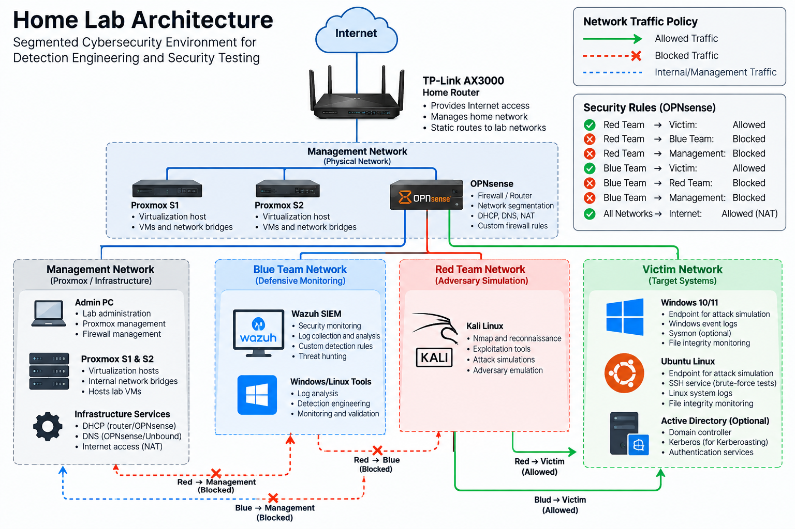
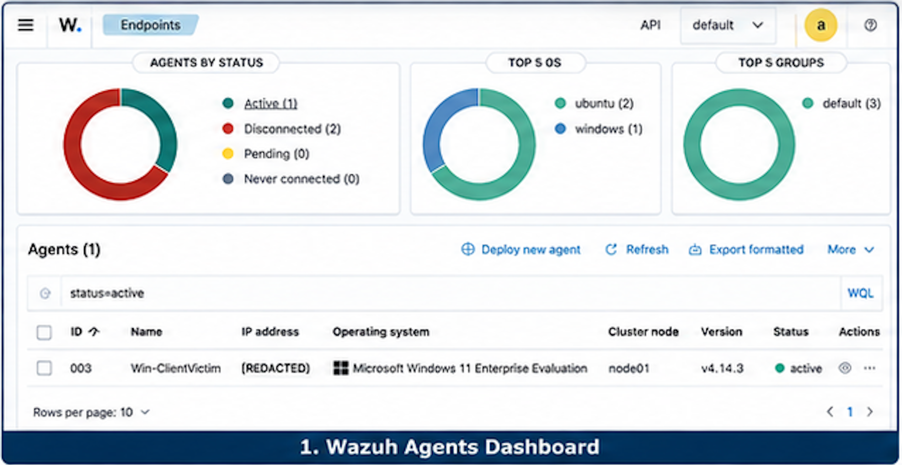
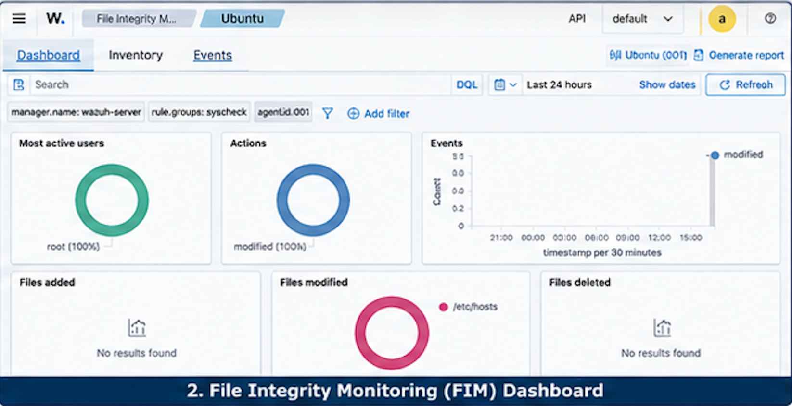
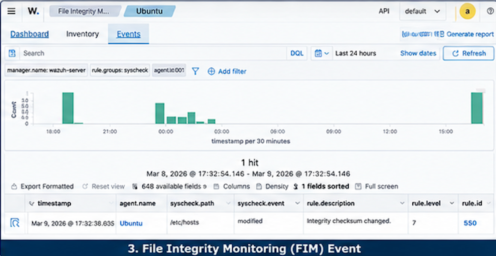
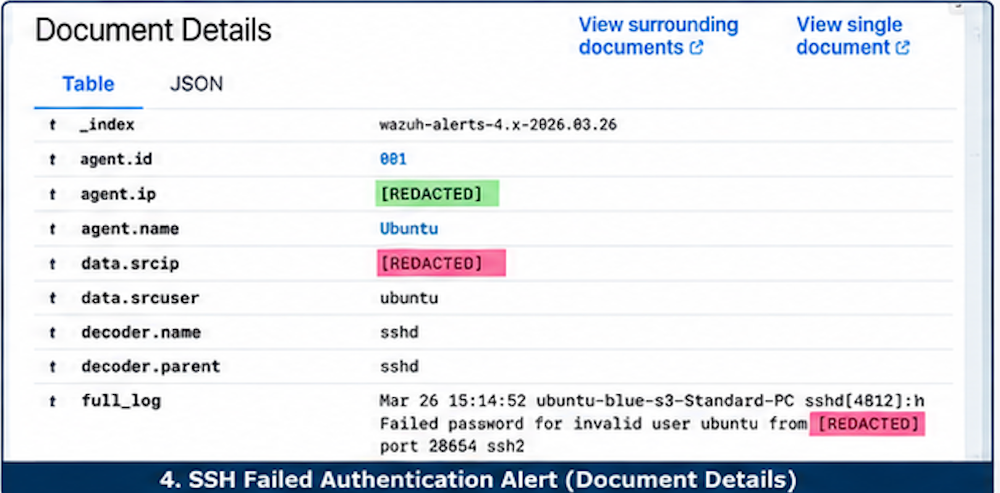
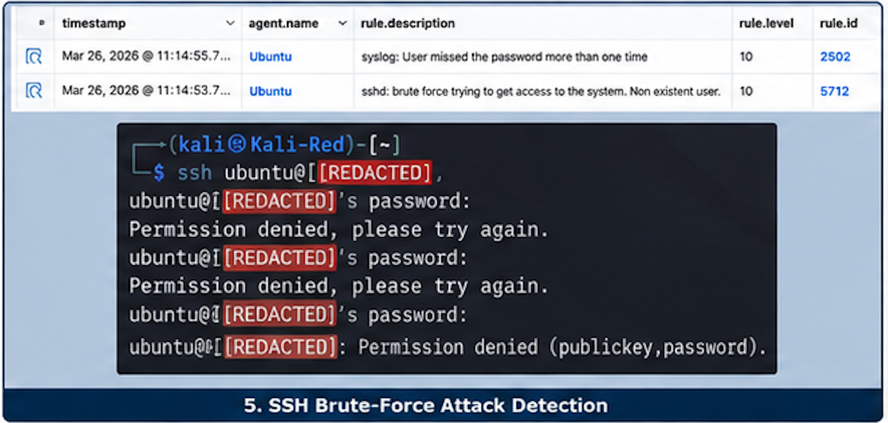
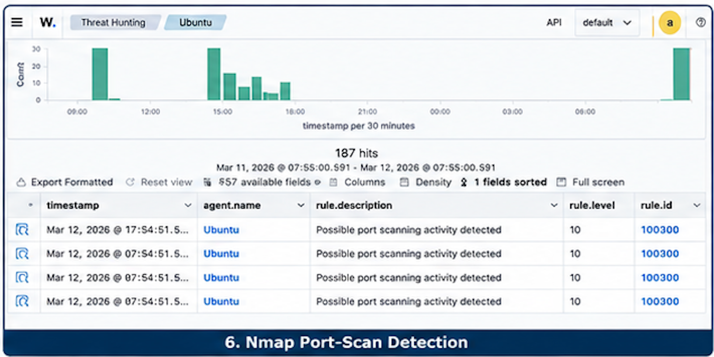
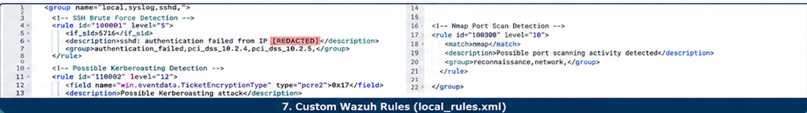
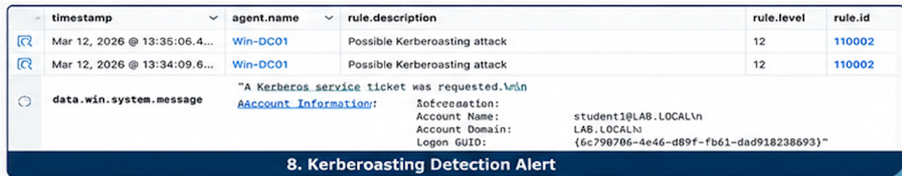

# Blue Team Detection Engineering Home Lab

A segmented cybersecurity home lab built to simulate enterprise network architecture, adversary activity, centralized security monitoring, and detection engineering.

The environment uses **Proxmox VE** for virtualization, **OPNsense** for routing and firewall enforcement, and **Wazuh SIEM/XDR** for endpoint monitoring and security analytics. Separate **Blue Team, Red Team, Victim, and Management** network segments provide an isolated environment for controlled attack simulations and defensive security testing.

> **Security Note:** Network addressing, identifying infrastructure information, and sensitive configuration details have been intentionally sanitized from this public repository.

---

## Lab Architecture

### Network Architecture

The lab is divided into four security zones:
| Network | Purpose |
|---|---|
| **Management** | Proxmox hosts, firewall administration, and infrastructure management |
| **Blue Team** | Wazuh SIEM and defensive monitoring infrastructure |
| **Red Team** | Kali Linux and controlled adversary simulation |
| **Victim** | Windows/Linux endpoints and Active Directory attack targets |

**OPNsense** acts as the security boundary between the networks and enforces custom firewall policies controlling communication between each zone.

### Segmentation Policy

- 🔴 **Red Team → Victim:** Allowed
- 🔴 **Red Team → Blue Team:** Blocked
- 🔴 **Red Team → Management:** Blocked
- 🔵 **Blue Team → Victim:** Allowed
- 🔵 **Blue Team → Red Team:** Blocked
- 🔵 **Blue Team → Management:** Blocked
- 🌐 Internet access is routed through OPNsense
- 🛡️ Inter-network traffic is controlled through explicit firewall policy

> Exact subnet and host addressing has been omitted from the public documentation.

---

## Technologies

| Category | Technologies |
|---|---|
| **Virtualization** | Proxmox VE |
| **Firewall / Routing** | OPNsense |
| **SIEM / XDR** | Wazuh |
| **Operating Systems** | Windows, Ubuntu Linux, Kali Linux |
| **Identity / Authentication** | Active Directory, Kerberos |
| **Networking** | TCP/IP, network segmentation, routing, DHCP, DNS, NAT |
| **Security Testing** | Nmap, SSH, PowerShell, vulnerability scanning |
| **Detection Engineering** | Wazuh custom rules, Windows Event Logs, Sysmon, File Integrity Monitoring |

---

## Network Security & Segmentation

The lab was designed to separate offensive, defensive, victim, and management infrastructure.

OPNsense provides routing between the isolated networks while custom firewall rules enforce security boundaries. The Red Team environment can interact with designated victim systems for controlled security testing but cannot directly access Blue Team or management infrastructure.

The environment also includes:

- Separate virtual network bridges within Proxmox
- DHCP services for isolated network segments
- DNS resolution through OPNsense
- Outbound NAT for controlled Internet connectivity
- Static routing between the physical and virtualized infrastructure
- Explicit allow/deny firewall policies between security zones

---

## Detection Engineering

Wazuh was deployed as the centralized SIEM/XDR platform to collect and analyze security telemetry from Windows and Linux endpoints.

Detection engineering exercises focused on identifying gaps in existing monitoring, simulating adversary behavior, analyzing resulting telemetry, and developing custom detection logic.

### Nmap Port Scan Detection

Simulated network reconnaissance from the Red Team environment against designated victim infrastructure.

A custom Wazuh detection rule was developed and validated to identify simulated port-scanning activity.

### SSH Brute-Force Detection

Generated repeated SSH authentication failures from the Red Team environment against an Ubuntu victim endpoint.

Wazuh telemetry was analyzed to validate detection of repeated authentication failures and brute-force behavior.

### Kerberoasting Detection

Simulated Kerberoasting activity within an Active Directory lab environment.

A custom Wazuh rule was developed using Windows Kerberos service-ticket telemetry to identify suspicious ticket-request activity associated with potential Kerberoasting.

**MITRE ATT&CK:** T1558.003 — Steal or Forge Kerberos Tickets: Kerberoasting

### File Integrity Monitoring

Configured Wazuh File Integrity Monitoring (FIM) to monitor designated Windows and Linux files and directories.

File modifications were generated in the lab and validated against Wazuh telemetry to confirm successful detection.

---

## Detection Coverage

Controlled attack simulations were used to evaluate existing detection capabilities and identify monitoring gaps.

Custom Wazuh detection rules were then developed and tuned, improving detection coverage from **33% to 100% across three evaluated attack scenarios**.

The process included:

1. Establishing baseline monitoring
2. Executing controlled adversary activity
3. Reviewing generated endpoint and SIEM telemetry
4. Identifying detection gaps
5. Developing custom detection logic
6. Re-running attack simulations
7. Validating successful alert generation

---

## Security Testing

The lab has been used to perform and analyze:

- Nmap network reconnaissance and port scanning
- SSH authentication and brute-force simulations
- Kerberos service-ticket activity
- File integrity modifications
- Suspicious PowerShell execution
- Simulated malware activity
- Vulnerability scanning
- Windows and Linux security log analysis
- Custom SIEM detection-rule validation
- Firewall and network segmentation testing

All offensive activity was conducted exclusively against systems within the controlled lab environment.

---

## Project Screenshots

The following screenshots document the lab environment, security telemetry, attack simulations, and custom detection engineering performed within the environment.

### 1. Wazuh Agents Dashboard

Wazuh endpoint monitoring showing an active Windows victim endpoint connected to the SIEM/XDR infrastructure.

### 2. File Integrity Monitoring Dashboard

Wazuh File Integrity Monitoring (FIM) configured to monitor changes on the Ubuntu endpoint, including modifications to monitored system files.

### 3. File Integrity Monitoring Event

Detection of a monitored file modification, demonstrating Wazuh's ability to generate and correlate file-integrity telemetry.

### 4. SSH Failed Authentication Alert

Wazuh alert telemetry generated from failed SSH authentication activity against the Ubuntu victim endpoint.

### 5. SSH Brute-Force Attack Detection

Controlled SSH authentication attempts from the Kali Linux Red Team system generated corresponding Wazuh brute-force alerts.

### 6. Nmap Port-Scan Detection

Custom Wazuh detection logic identifying simulated Nmap reconnaissance against victim infrastructure.

### 7. Custom Wazuh Detection Rules

Custom Wazuh rules developed for SSH authentication failures, Nmap port-scanning activity, and potential Kerberoasting behavior.

### 8. Kerberoasting Detection Alert

Custom Wazuh detection identifying suspicious Kerberos service-ticket activity associated with simulated Kerberoasting behavior in the Active Directory environment.

---

## Skills Demonstrated

- Detection Engineering
- Security Information and Event Management (SIEM)
- Network Security
- Network Segmentation
- Firewall Administration
- Threat Hunting
- Security Monitoring
- Active Directory Security
- Kerberos Security
- Windows Security
- Linux Security
- Log Analysis
- Adversary Simulation
- Vulnerability Assessment
- Virtualization
- Incident Detection

---

## Future Development

Planned improvements to the lab include expanding detection coverage, developing additional custom SIEM rules, mapping detections to the MITRE ATT&CK framework, and introducing additional attack simulations and security telemetry sources.

---

## Disclaimer

This project was created for cybersecurity education, defensive security research, and controlled security testing. All attack simulations were performed against systems owned and operated within an isolated lab environment.
